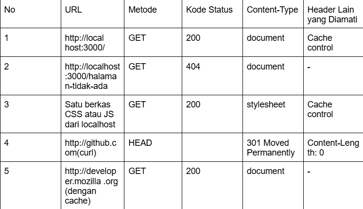
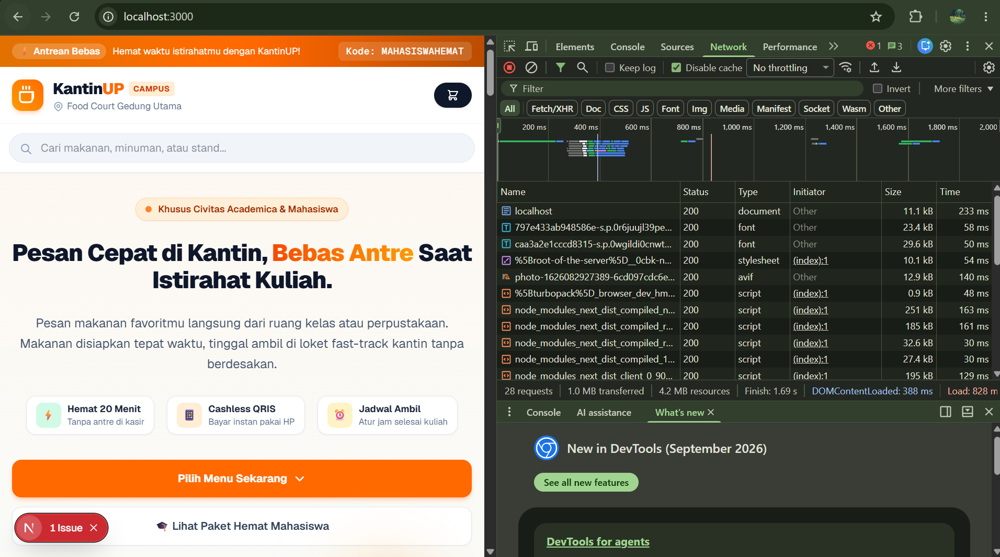
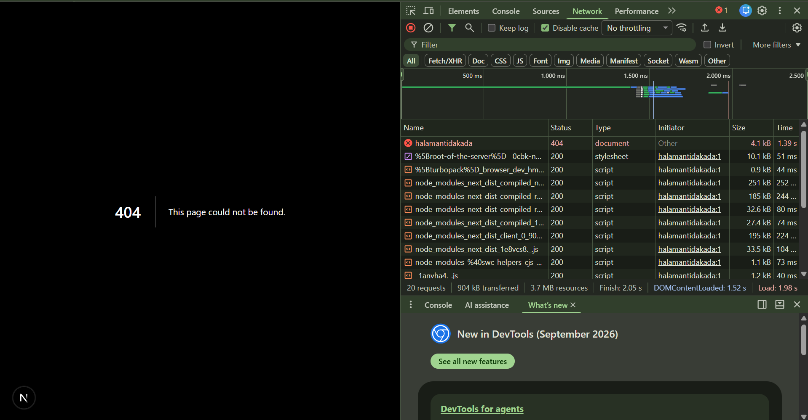
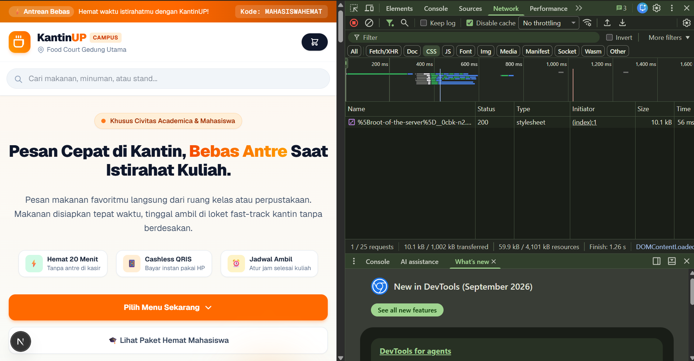
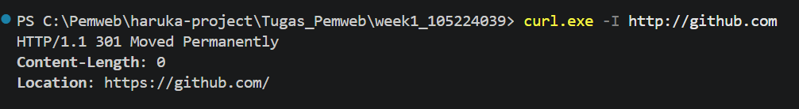
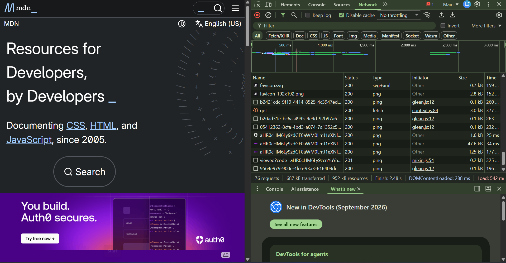

docs/praktikum/modul-01.md
# Dokumen Teknis Modul 1 — Lingkungan Pengembangan, Git, dan Lalu Lintas
HTTP
Nama/NIM : 105224039
Repositori : 

## 1. Lingkungan Pengembangan

|---------------------------------------------|
| Software	          |          Versi        |
| --------------------------------------------|
|Windows	            |     10.0.26200.9445   |
|nvm                  |       	2.0.0         |
|Node.js              |         24.21.0       |
|npm	                |         12.1.0        |
|Git	                |     2.52.0.windows.1  |
|Visual Studio Code   |   	   1.139.1        |
|---------------------------------------------|

## 2. Alur Kerja Git
- Keluaran git log --oneline --graph
  * 7482fb3 (HEAD -> main, origin/main) week 1
- Tautan pull request yang telah digabungkan
  -
- Konflik yang terjadi, cara penyelesaian, dan alasan pemilihan isi akhir
  jawab :
  Konflik yang terjadi, cara penyelesaian, dan alasan pemilihan isi akhir
  Tidak ada konflik yang terjadi selama proses penggabungan (merge).

## 3. Pengamatan Lalu Lintas HTTP
- Lembar kerja pengamatan (Tabel 9) beserta tangkapan layar DevTools
   
   
   
   
   
   

- Keluaran curl -I dan curl -v
   

- Analisis: perbedaan status dan ukuran antara pemuatan dengan dan tanpa
cache,
 alasan metode curl -I adalah HEAD, dan alasan http://github.com dialihkan
 jawab : 
 * Perbedaan Status dan Ukuran (Dengan vs Tanpa Cache):

 * Pemuatan tanpa cache memaksa browser mengirimkan permintaan utuh ke server asal sehingga ukuran data yang ditransfer adalah sebesar bodi berkas aslinya. Sebaliknya,  pemuatan dengan cache memanfaatkan salinan berkas yang sudah tersimpan di lokal perangkat, sehingga ukuran data yang ditransfer menjadi jauh lebih kecil (bahkan 0 byte) dan responnya lebih cepat.

- Alasan Opsi curl -I Menggunakan Metode HEAD:

* Perintah curl -I secara khusus dirancang hanya untuk meminta informasi header HTTP dari server tanpa mengunduh konten bodi sama sekali, sehingga cURL secara otomatis mengeksekusi metode HTTP HEAD untuk efisiensi.

Alasan [http://github.com](http://github.com) Dialihkan (Redirect):

Protokol HTTP biasa bersifat tidak terenkripsi, sehingga untuk melindungi privasi pengguna, menjamin keamanan data, dan mencegah penyadapan, GitHub secara otomatis mengalihkan (redirect) seluruh lalu lintas HTTP menuju versi HTTPS yang aman dan terenkripsi.

## 4. Kendala dan Penyelesaian
 tidak ada kendala 

## 5. Catatan Pemanfaatan AI
Create a simple and modern homepage interface for a campus food ordering web application called KantinUP.

The target users are university students who want to order food from the campus canteen and reduce the time spent waiting in line.

Create the interface as a single page.tsx file using Next.js, React, and Tailwind CSS. Do not create separate components or additional files.
