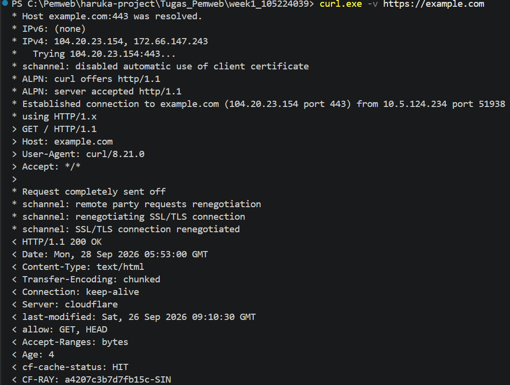

docs/praktikum/modul-01.md
# Dokumen Teknis Modul 1 — Lingkungan Pengembangan, Git, dan Lalu Lintas
HTTP
Nama/NIM : 105224039
Repositori : https://github.com/putu-cpu/PemWeb_week1_105224039

## 1. Lingkungan Pengembangan

| Perangkat | Versi |
|---|---|
| Windows |  10.0.26200.9445  |
| nvm   | 2.0.0    |
| Node.js  | 24.21.0    |
| npm |  12.1.0  |
| Git|  2.52.0.windows.1  |
| Visual Studio Code|  1.139.1   |

## 2. Alur Kerja Git

### 2.1 Keluaran git log --oneline --graph

```
* b873dd9 (HEAD -> main, origin/main) week 1
* 0a8da58 (origin/fitur-baru) Menambahkan fitur baru
* 7482fb3 week 1
```
perubahan branch fitur-baru digabungkan ke main tanpa konflik sehingga riwayat tetap linier (fast-forward), ditandai branch origin/fitur-baru yang mengarah ke komit 0a8da58.

### 2.2 Tautan Pull Request

- **PR #1:** https://github.com/putu-cpu/PemWeb_week1_105224039/pull/1
- **Judul:** Menambahkan fitur baru
- **Status:** sudah digabungkan (*merged*) ke `main`.

### 2.3 Konflik

Tidak ada konflik yang terjadi saat proses penggabungan (merge), karena
perubahan pada branch fitur dan branch main tidak menyentuh baris/file
yang sama, sehingga Git dapat menggabungkannya secara otomatis.

## 3. Pengamatan Lalu Lintas HTTP

### 3.1 Lembar Kerja Pengamatan (Tabel 9)

- Lembar kerja pengamatan (Tabel 9) beserta tangkapan layar DevTools
| No | URL / Sumber | Keterangan |
|---|---|---|
| 1 |[Tabel 9](image-6.png) | Tabel 9 |
| 2 |[http://local host:3000/](image.png) | Halaman utama |
| 3 |[http://localhost:3000/halaman-tidak-ada](image-1.png) | Halaman tidak ditemukan (404) |
| 4 |[Satu berkas CSS atau JS dari localhost](image-2.png) | Satu berkas statis |
| 5 |[http://github.com(curl)](image-3.png) | Pengamatan dengan curl |
| 6 |[http://developer.mozilla .org (dengan cache) ](image-4.png) | Dengan cache |

### 3.2 Keluaran curl -I dan curl -v



### 3.3 Analisis

**1. Perbedaan status dan ukuran antara pembebanan dengan dan tanpa cache**

Saat halaman dimuat **tanpa cache**, browser mengirimkan permintaan utuh ke server dan menerima seluruh isi berkas, sehingga statusnya `200 OK` dengan ukuran transfer sebesar bodi berkas aslinya. Sebaliknya, saat dimuat **dengan cache**, browser mengirimkan permintaan bersyarat (header `If-Modified-Since`/`If-None-Match`); karena berkas belum berubah, server membalas `304 Not Modified` **tanpa body**, sehingga ukuran transfer menjadi 0 B (sesuai Tabel 9) dan waktu muat lebih cepat — browser cukup menggunakan salinan yang sudah tersimpan di perangkat.

**2. Alasan metode curl -I adalah HEAD**

Opsi `-I` (atau `--head`) memerintahkan curl untuk mengambil **header respons saja** tanpa mengunduh body. Standar HTTP mendefinisikan metode `HEAD` persis untuk kebutuhan ini: server memprosesnya sama seperti `GET` dan mengembalikan header yang identik, hanya saja body-nya dibuang. Karena itu `curl -I` secara efektif berarti curl mengeksekusi metode `HEAD` — lebih efisien untuk memeriksa status, tipe konten, dan aturan caching tanpa membuang-buang bandwidth.

**3. Alasan http://github.com dialihkan (redirect)**

Saat `curl -v http://github.com` dijalankan, GitHub membalas status `301 Moved Permanently` dengan header `Location: https://github.com/`, lalu curl mengikuti pengalihan tersebut. Alasannya adalah keamanan: trafik HTTP bersifat teks polos (tidak terenkripsi) sehingga rentan penyadapan dan perusakan data. Dengan memaksa seluruh lalu lintas ke **HTTPS**, GitHub menjamin kerahasiaan dan integritas data pengguna, sekaligus menjaga satu URL kanonik yang baik untuk SEO.

## 4. Kendala dan Penyelesaian

Tidak ditemukan kendala selama pengerjaan modul 1.

## 5. Catatan Pemanfaatan AI
- **Alat**: Chatgpt, Gemini
- **Perintah utama**: meminta dibuatkan antarmuka halaman utama (homepage) untuk aplikasi pemesanan makanan kampus.

  Prompt lengkap yang digunakan:

  > Create a simple and modern homepage interface for a campus food ordering
  > web application called KantinUPJ. The target users are university students
  > who want to order food from the campus canteen and reduce the time spent
  > waiting in line. Create the interface as a single page.tsx file using
  > Next.js, React, and Tailwind CSS. Do not create separate components or
  > additional files.

- **Bagian yang digunakan**: struktur komponen halaman (header, hero section,
  daftar menu), kelas-kelas Tailwind untuk styling, dan susunan JSX pada
  `page.tsx`. Tata letak dan teks yang dihasilkan kemudian disesuaikan dengan
  kebutuhan proyek.
- **Cara memverifikasi**: kode hasil AI dijalankan dengan `npm run dev`, lalu
  halaman diperiksa di browser pada `http://localhost:3000` dan melalui DevTools
  untuk memastikan tidak ada error di konsol, tampilan layout sesuai, dan seluruh
  elemen berfungsi. Bagian yang kurang sesuai (misalnya warna dan teks) diubah
  secara manual.
